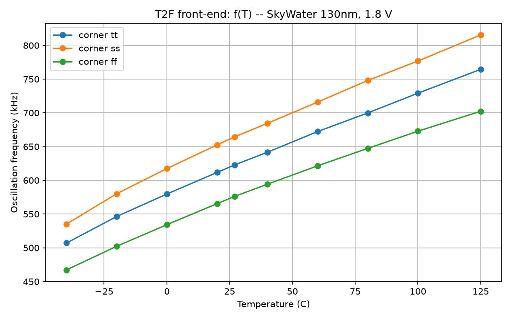
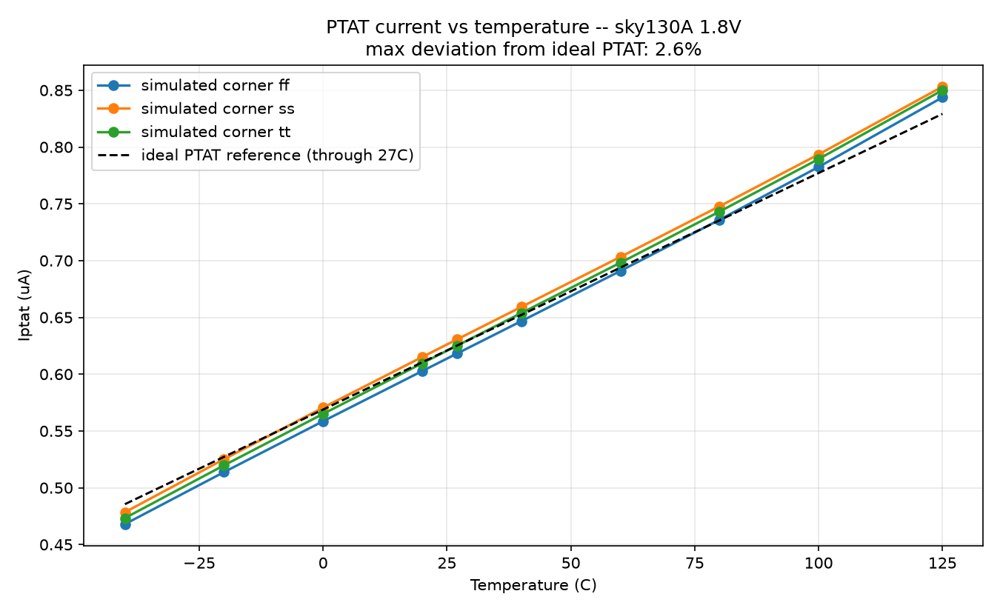
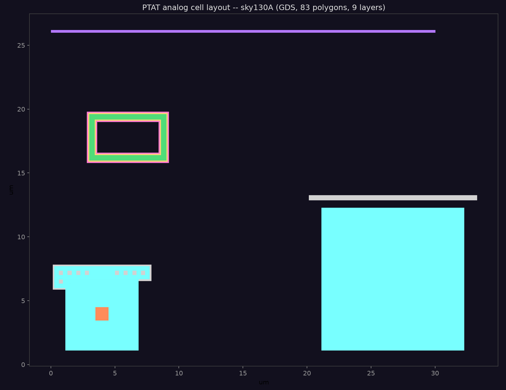

# 温度传感器芯片架构设计 (Temperature Sensor Chip Architecture)

基于 IIC-OSIC-TOOLS 容器、SkyWater 130nm (sky130A) PDK 的智能温度传感器芯片。

## 1. 芯片规格 (Target Specification)

| 项目 | 指标 |
|---|---|
| 工艺 | SkyWater 130nm (sky130A) |
| 电源 | 1.8 V |
| 温度范围 | -40 ℃ ~ +125 ℃ |
| 分辨率 | 0.5 ℃ (9-bit, 补码, LM75 风格) |
| 校准后精度 | ±3 ℃ (两点校准, 取决于 f(T) 线性度) |
| 接口 | I2C 从机, 7-bit 地址 0x48, 最高 400 kHz |
| 寄存器 | 温度(0x00-0x01)、配置(0x02)、Thyst(0x03)、TOS(0x04) |
| 传感器核 | PTAT 电流源 + 电流饥饿环形振荡器 (T2F) |
| 测量门控 | 10 ms (由系统时钟分频, 默认 10 MHz) |
| 功耗 | 模拟前端 ~10 µA (PTAT 0.6 µA + OTA 5 µA + 振荡器) + 数字 ~0.1 mW |

## 2. 系统架构

```
                         ┌────────────────────────────────────┐
                         │            temp_sensor_top          │
                         │                                    │
  VDD ──┐                │  ┌───────────┐      ┌──────────┐   │
        │    ┌──────────┐ │  │ temp_engine│      │ temp_regs│  │
  PTAT (Banba)  │          │  │ (T2F 计数 + │     │ (寄存器  │  │
  + T2F 振荡器 │   fout ──┼─▶│  校准)      │◀───▶│  文件)   │  │
        │    └──────────┘ │  └───────────┘      └──────────┘   │
  VSS ──┘                │        ▲                  ▲         │
                         │        │                  │         │
                         │  ┌─────┴───────┐    ┌─────┴────┐    │
                         │  │  i2c_slave  │◀──▶│ scl/sda  │    │
                         │  └─────────────┘    └──────────┘    │
                         │                        os_int        │
                         └────────────────────────────────────┘
```

**工作流程：**
1. **模拟前端**：Banba OTA 型 PTAT 产生与绝对温度成正比电流 Iptat = ΔVbe/R1；
   电流饥饿环形振荡器 (CSRO) 以 Iptat 为各级电流源/阱，振荡频率 f ∝ Iptat ∝ T。
2. **数字核**：`temp_engine` 在 10 ms 门控窗口内计数 fout 上升沿得到 raw count；
   用两点校准常数 (CAL_C0, CAL_C1, GAIN) 将 count 映射为 9-bit 温度（0.5 ℃ LSB）。
3. **I2C 接口**：主机写指针、读温度寄存器；`os_int` 输出过温告警（比较器模式带迟滞）。

## 3. 模拟前端设计

### 3.1 PTAT 电流源 (Banba OTA-forced)

```
  VDD ── M1 ── a ── R1 ── Q1(e)     Q1: sky130_fd_pr__pnp_05v5_W3p40L3p40 (~10x)
  VDD ── M2 ── b ── Q2(e)          Q2: sky130_fd_pr__pnp_05v5_W0p68L0p68
        OTA: in+ = a, in- = b, out = M1/M2 栅极 (gmir)
```

- OTA 强制 V(a)=V(b) → I·R1 = Vbe2 - Vbe1 = VT·ln(N) → **I = VT·ln(N)/R1 ∝ T**，
  与镜像管强度无关（关键：避免了自偏置 Widlar 在低温下环路易收敛到零电流解的缺陷）。
- R1 = 100 kΩ, N ≈ 10 → Iptat ≈ 0.6 µA @ 27 ℃。
- **重要 PDK 注意点**：sky130 PNP 子电路忽略 `mult` 参数——面积比必须用
  不同尺寸器件 (W3p40 vs W0p68) 实现，用 `mult` 不会产生 ΔVbe！
- OTA 为 5 管结构（PMOS 输入对 + NMOS 镜像负载），尾电流源在 VDD 侧。

### 3.2 T2F 温度-频率转换 (CSRO)

5 级电流饥饿环形振荡器：每级为
`VDD → [PMOS 电流源: gmir] → va → [PMOS 开关] → out → [NMOS 开关] → vb → [NMOS 电流阱: gn_bias] → VSS`。
f = Istage / (N·C·Vswing)，Istage = Iptat（1:1 镜像），C = 100 fF/级（模拟寄生）。

### 3.3 仿真结果（ngspice, sky130A tt/ss/ff 角点）





完整数据见 `analog/sim/results_*.csv` 与 `analog/sim/ptat_results.csv`；
关键数据在 `scripts/t2f_model_params.py`。

## 4. 数字核心设计

### 4.1 temp_engine（测量引擎）
- 门控：GATE_CYCLES 个系统时钟（10 MHz 下 100000 拍 = 10 ms）。
- 计数：门控内 fout 上升沿 → 16-bit raw count。
- 校准：`temp_half = ((raw - C0)·GAIN) >> 8 + T0_HALF`（0.5 ℃ 单位），饱和到 [-55,125] ℃。

### 4.2 i2c_slave（I2C 从机）
- 7-bit 地址 0x48；支持 400 kHz SCL。
- 字节级状态机：地址→ACK→指针→数据→自动递增；读操作支持多字节连续读。
- 主设备 NACK 后停止传输；错误地址不 ACK。
- SDA 开漏输出，3 拍滑动滤波抗毛刺。

### 4.3 寄存器映射

| 指针 | 名称 | 读写 | 说明 |
|---|---|---|---|
| 0x00 | TEMP_MSB | R | 温度高 8 位（9-bit 补码 [8:1]） |
| 0x01 | TEMP_LSB | R | bit7 = 0.5 ℃ 位 |
| 0x02 | CONFIG | R/W | bit7=shutdown, bit6=comparator, bit1:0=分辨率 |
| 0x03 | THYST | R/W | 迟滞阈值（0.5 ℃ 单位） |
| 0x04 | TOS | R/W | 过温阈值（0.5 ℃ 单位） |

## 5. 验证与流程

| 阶段 | 工具 | 结果 |
|---|---|---|
| 模拟前端 | ngspice | f(T) 温度扫描 + 3 角点 (见 analog/sim) |
| 数字 RTL | iverilog | tb_i2c (6 项协议测试全过), tb_top (全芯片) |
| 综合 | Yosys | sky130_fd_sc_hd, ~5558 µm² (561 单元) |
| 版图 | magic | 模拟单元 (见 layout/)，DRC 检查 + GDS 导出 |

### 5.1 模拟版图（magic, sky130A）

PTAT 模拟单元版图：两个衬底 PNP（W0p68 / W3p40，采用 PDK 器件几何）、
p+ poly 电阻与金属布线；由 magic 绘制并导出 GDS，经 KLayout/gdspy 渲染如下：



版图文件：`layout/ptat_cell.mag`（magic 源）、`layout/ptat_cell.gds`（GDS 导出）、
`layout/ptat_cell.tcl`（生成脚本）。

## 6. 目录结构

```
temp-sensor-chip/
├── analog/spice/       # PTAT/T2F 网表 + 测试平台
├── analog/sim/         # 仿真结果 (CSV/日志/图)
├── rtl/                # 数字 RTL (i2c_slave, temp_engine, temp_regs, top)
├── tb/                 # 测试平台 (i2c 主模型, t2f 模型, tb_i2c, tb_top)
├── scripts/            # 驱动脚本 (run_analog, gen_t2f_model, ...)
├── syn/                # Yosys 综合
├── layout/             # magic 版图
├── docs/               # 本文档
└── Makefile            # sim/synth/model 目标
```
